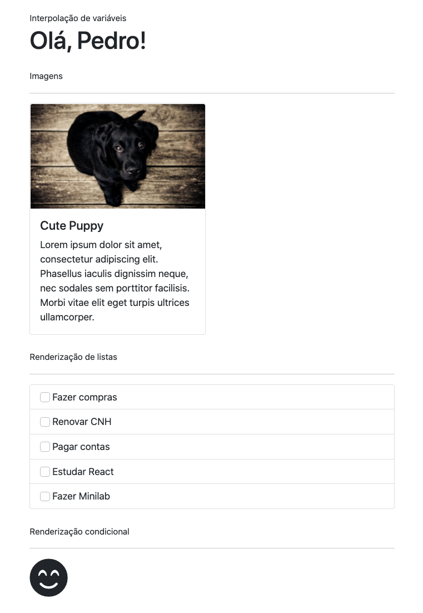

# MINILAB | React - Treino de JSX

Neste minilab vamos exercitar as regras do JSX, a sintaxe modificada de Javascript usada pelo React.

## Requerimentos

- Faça um fork deste repositório
- Clone este repositório
- Dentro da pasta do projeto, execute `npm install` em seu terminal para instalar todas as dependências
- Execute `npm start` para abrir o projeto em seu navegador

## Instruções

O objetivo do exercício é obter um resultado semelhante à esse:



### Passo 1: Interpolação de variáveis

Vá até o arquivo `Greeting.js` e defina um componente que exiba o texto "Olá, `nome`", onde `nome` é uma variável que contém seu nome. Lembre-se das regras de interpolação de variáveis no JSX! Também não se esqueça de importar e invocar seu componente no arquivo `App.js`

### Passo 2: Usando imagens no JSX

Vá até o arquivo `Profile.js` e defina um componente para exibir um card de perfil de usuário, exibindo como foto de perfil a imagem no caminho `/assets/images/puppy.jpg`. Para te ajudar com o CSS, você pode usar o HTML pré-estilizado dos [cards](https://getbootstrap.com/docs/5.0/components/card/) do Bootstrap. Lembre-se, a forma de definir tags  no JSX difere do HTML tradicional em relação ao atributo `src`!

### Passo 3: Renderização de listas

Vá até o arquivo `ToDoList.js` e defina um componente para exibir uma lista de tarefas. Sua lista deve usar a seguinte array para exibir o JSX:

```javascript
const tasks = [
  "Fazer compras",
  "Renovar CNH",
  "Pagar contas",
  "Estudar React",
  "Fazer Minilab",
];
```

Percorra cada elemento da array e retorne um pedaço de JSX para obter um resultado semelhante ao da imagem acima. Você pode usar o HTML pré-estilizado dos [list groups](https://getbootstrap.com/docs/5.0/components/list-group/) do Bootstrap para te auxiliar com o CSS.

### Passo 4: Renderização condicional

Vá até o arquivo `EmotionMeter.js` e defina um componente que exibe uma "carinha" feliz ou triste, dependendo do valor de uma variável. Defina uma variável `emotion` para guardar a emoção atual. Essa variável pode ter dois valores (strings): `"HAPPY"` e `"SAD"`. Caso o valor dela seja `"HAPPY"`, exiba uma carinha feliz. Caso seja `"SAD"`, exiba uma carinha triste. Você pode obter ícones de emojis no [Font Awesome](https://fontawesome.com/v5.15/icons?d=gallery&p=2) (a fonte dos ícones já foi importada no arquivo `public.html`).

## Entrega

Quando terminar, copie e cole o link do seu repositório (basta copiar a URL atual do seu navegador) na unidade deste exercício no Student Portal (my.ironhack).
